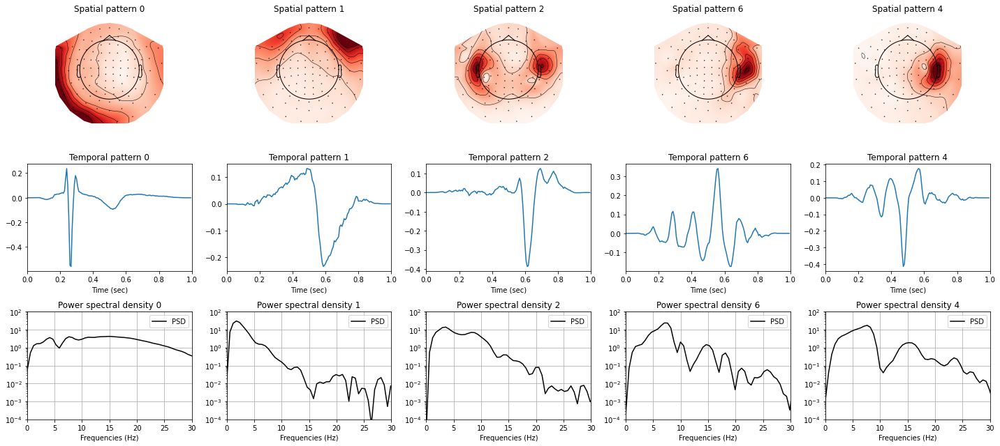
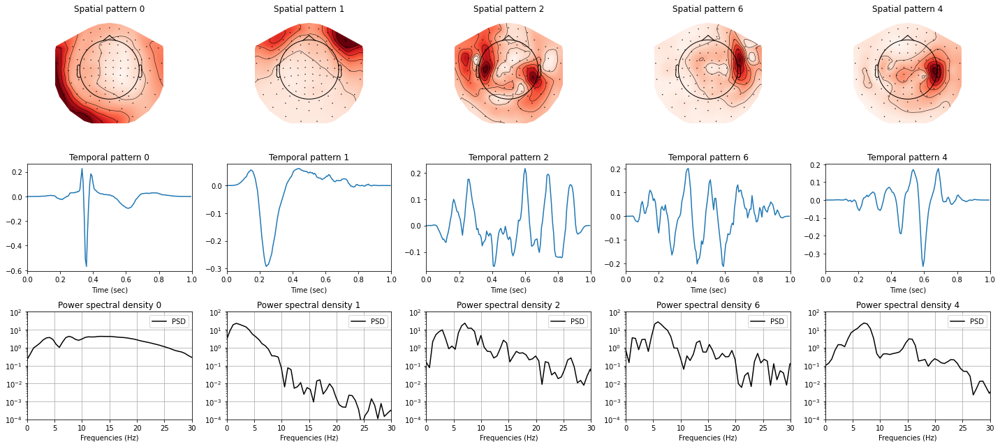

# Experiments for Convolution Sparse Coding (CSC) using alphacsc library

__This repository aims at replicating the experiments of the paper cited in the [Citation](#citation) section on [sample data](https://mne.tools/dev/generated/mne.datasets.sample.data_path.html) and providing new experiments.__

Two Jupyter Notebooks are provided to reproduce the results that are presented in the [Results for CSC solvers](#results-for-csc-solvers) and the [Results for LGCD rank-1 experiments](#Results-for-LGCD-rank-1-experiments). They can be directly launched in Google Colab from here:
- <a href="https://colab.research.google.com/github/dinalzein/CSC/blob/main/comparison_of_CSC_solvers.ipynb" target="_parent"></a> for the performance of CSC solvers.  
- <a href="https://colab.research.google.com/github/dinalzein/CSC/blob/main/LGCD_rank1_experiments.ipynb" target="_parent"></a> for LGCD rank-1 vs non rank-1 experiments.


A [report](./report.pdf) has been made to give an overview of the paper cited in [Citation](#citation) and analyze the results of the experiments.


## Results for CSC solvers
For all results, smaller is better.
The results below present the time in sec to reach a precision of 0.01 using the state-of-the-art CSC solvers for univariate signals for different values of the sparsity constraint .
| Algorithm                                 |  |   |    | 
|---                                        |---    |---    |---    |---
CBPDN (Garcia-Cardona et al, 2018)          | 20    | 70    | 90    | 110
FISTA (Jas et al, 2017)                     | 13    | 165   | 157   | 148
LBFGS (Jas et al, 2017)                     | 75    | 142   | 170   | 175
LGCD  (La Tour et al, 2018)                 | 480   | 320   | 190   | 80

The results below present the time in sec to reach a precision of 0.01 using the state-of-the-art CSC solvers for multivariate signals for different values of the sparsity constraint $\lambda$.
| Algorithm                                 |  |   |    | 
|---                                        |---    |---    |---    |---
CBPDN (Wohlberg, 2106)                      | 40    | 57    | 61    | 60
LGCD rank-1 (Jas et al, 2017)               | 168   | 145   | 122   | 50
LGCD full rank (Jas et al, 2017)            | 135   | 125   | 115   | 82


## Results for LGCD rank-1 experiments

<table style="width:100%; table-layout:fixed;">
	<tr>
		<td></td>
	</tr>
	<tr>
		<td> Results obtained after learning atoms with rank-1 constraint on the sample data. The first row shows the spatial pattern of the 5 preselected atoms of interest, i.e. atoms that are mapped on top of the sensors. The middle row display the temporal pattern of these preselected atom. The last row displays the power spectral density (PSD). In terms of neuroscientific interpretation, the temporal pattern associated with atom 0 shows a heartbeat artefact. It is well recognizable by its QRS components that represents the spread of a stimulus through the ventricles. The spatial pattern associated to this event is represented outside of the scalp, as the origin of this signal is further away from the source of measurement. The spatial and temporal patterns associated with atom 1 represent the recovery of blink artefacts. The spatial and temporal patterns associated with atom 2 seem to correspond to a bilateral regions inside the brain, which could be consistent considering the alternance of laterality (right/left) of the task events.</td>
	</tr>
</table>

<table style="width:100%; table-layout:fixed;">
	<tr>
		<td></td>
	</tr>
	<tr>
		<td> Results obtained after learning atoms without the rank1 constraint on the sample data. The first row shows the spatial pattern (map) of the 5 preselected atoms of interest. The second row displays the temporal pattern of these preselected atom. The last row displays the power spectral density (PSD).</td>
	</tr>
</table>


### Citation
To cite this work in your publications

MLA format:
```
Dupré la Tour, Tom, et al. "Multivariate convolutional sparse coding for electromagnetic brain signals." Advances in Neural Information Processing Systems 31 (2018).
```
Or in BibTeX format:
```
@article{dupre2018multivariate,
  title={Multivariate convolutional sparse coding for electromagnetic brain signals},
  author={Dupr{\'e} la Tour, Tom and Moreau, Thomas and Jas, Mainak and Gramfort, Alexandre},
  journal={Advances in Neural Information Processing Systems},
  volume={31},
  year={2018}
}
```

### Used materials and 3rd party code
The experiment is based on the [*alphacsc*](https://alphacsc.github.io) library ( Copyright 2017-2018, Mainak Jas.) and the paper "Multivariate Convolutional Sparse Coding for Electromagnetic Brain Signals" by Tom Dupré la Tour, Thomas Moreau, Mainak Jas Vayatis, Alexandre Gramfort [[paper]](https://proceedings.neurips.cc/paper/2018/file/64f1f27bf1b4ec22924fd0acb550c235-Paper.pdf)
